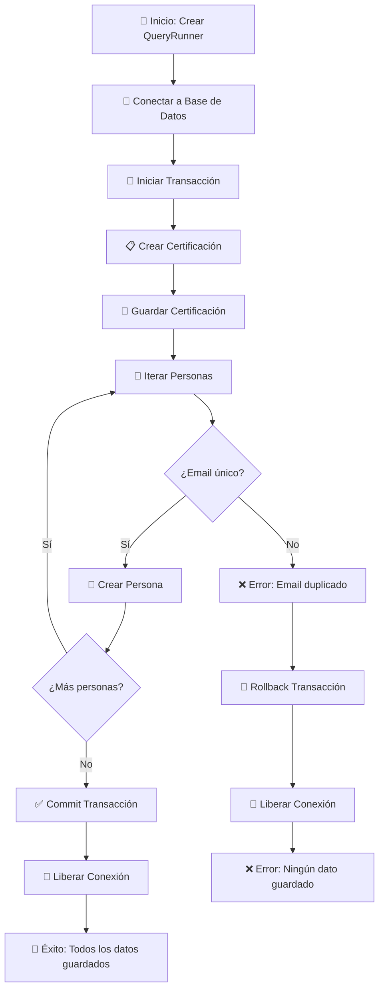
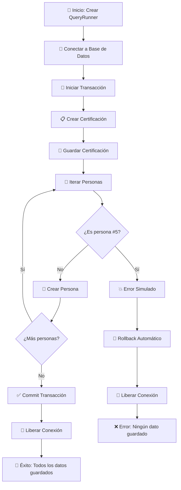
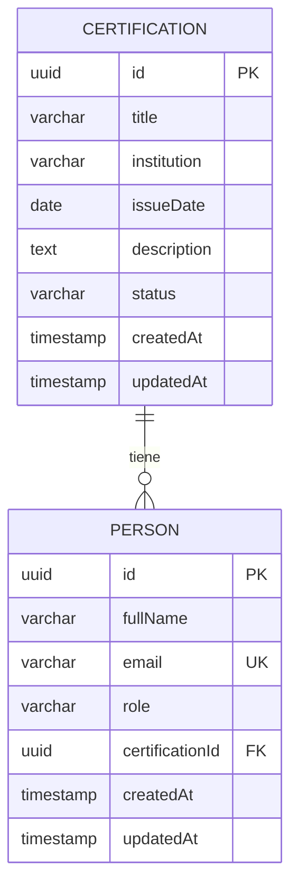
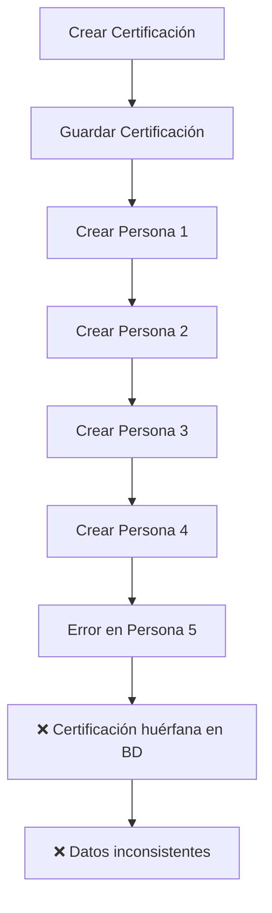
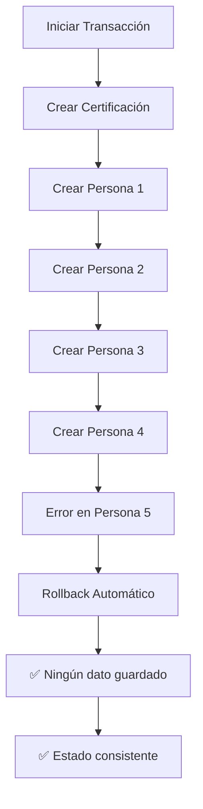
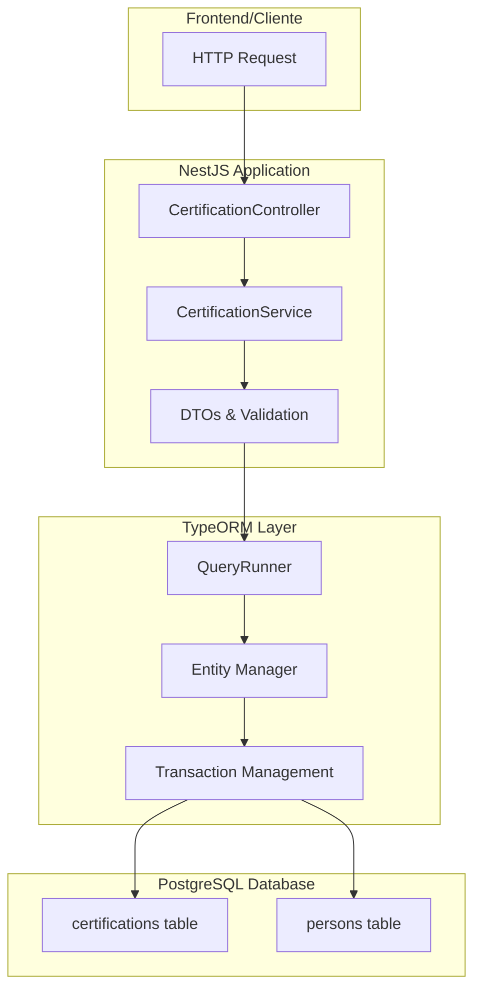
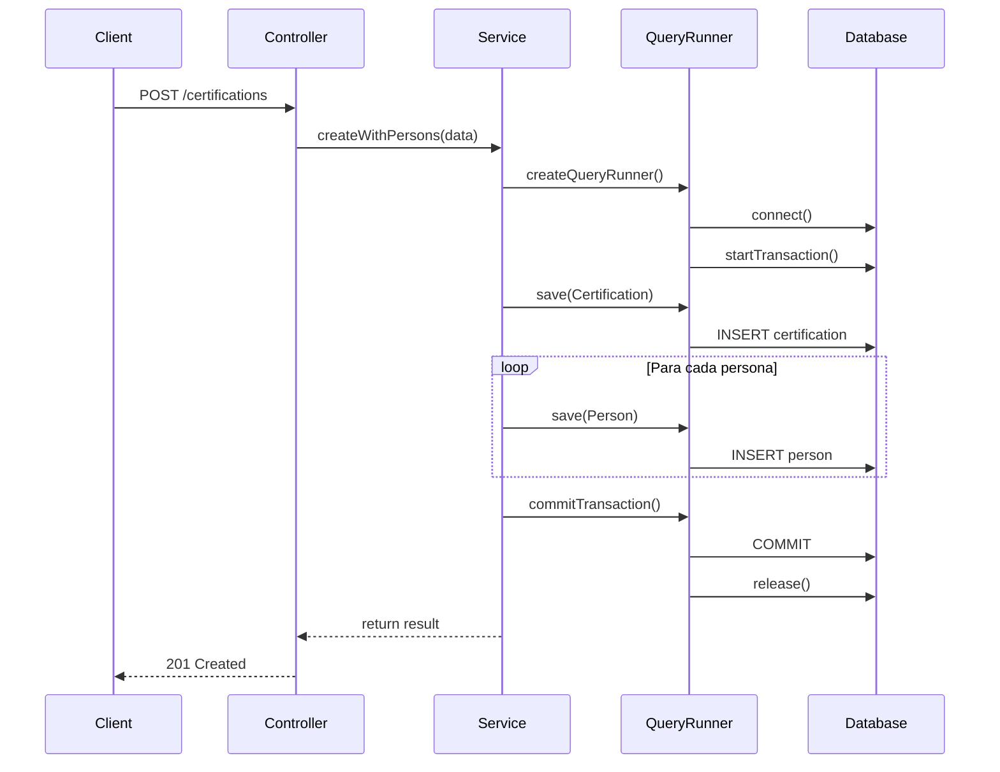
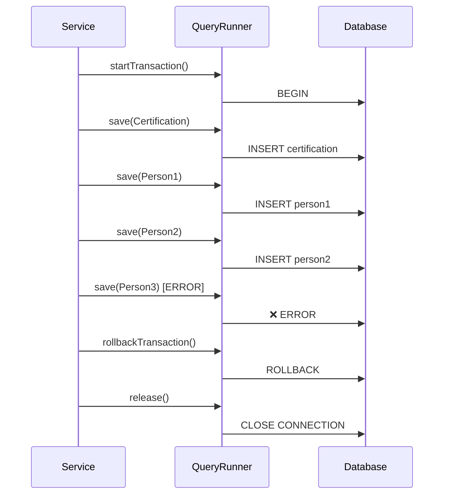

# 🔄 Diagrama del Flujo de Transacciones

## Flujo Exitoso ✅

## Flujo con Error Simulado ❌

## Arquitectura del Sistema

## Estados de la Transacción

```mermaid
stateDiagram-v2
    [*] --> Iniciando
    Iniciando --> Conectando: Crear QueryRunner
    Conectando --> TransaccionIniciada: Conectar exitoso
    TransaccionIniciada --> CreandoCertificacion: Iniciar transacción
    CreandoCertificacion --> CreandoPersonas: Certificación guardada
    CreandoPersonas --> ValidandoEmail: Crear persona
    ValidandoEmail --> CreandoPersonas: Email único
    ValidandoEmail --> Error: Email duplicado
    CreandoPersonas --> Commit: Todas las personas creadas
    Commit --> Exito: Commit exitoso
    Error --> Rollback: Error detectado
    Rollback --> Falla: Rollback completado
    Exito --> [*]
    Falla --> [*]
```

## Comparación: Con vs Sin Transacciones

### Sin Transacciones (Problemático) ❌

### Con Transacciones (Correcto) ✅

## Componentes del Sistema

## Flujo de Datos en el Laboratorio

## Manejo de Errores

---

## 📝 Notas Importantes

1. **Atomicidad**: Todo el proceso es una sola unidad de trabajo
2. **Consistencia**: Los datos siempre están en un estado válido
3. **Aislamiento**: Las transacciones no interfieren entre sí
4. **Durabilidad**: Los cambios se mantienen después de commit

### Puntos Críticos del Laboratorio

- ✅ **QueryRunner**: Manejo manual de conexiones y transacciones
- ✅ **Rollback automático**: En caso de cualquier error
- ✅ **Validaciones**: Emails únicos y datos requeridos
- ✅ **Liberación de recursos**: Siempre se libera la conexión
- ✅ **Logging**: Trazabilidad completa del proceso
